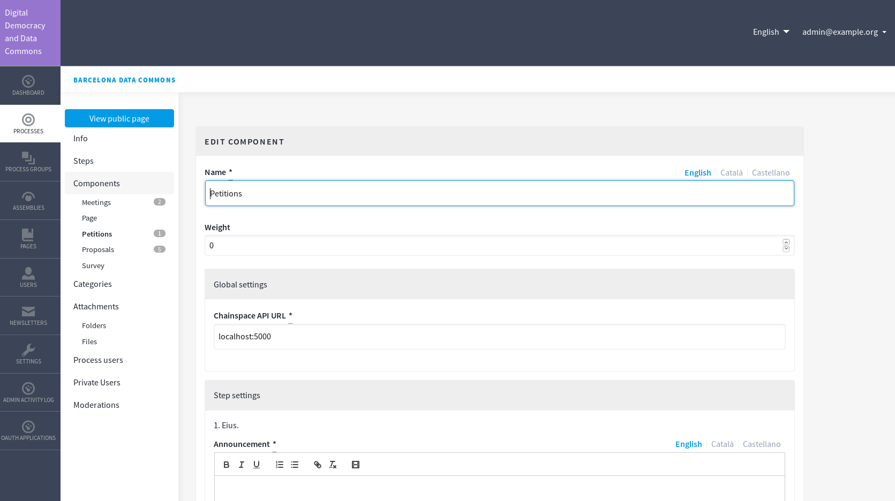

# decidim-petitions

[](https://circleci.com/gh/alabs/decidim-module-petitions)
[](https://codeclimate.com/github/alabs/decidim-module-petitions)
[](https://codeclimate.com/github/alabs/decidim-module-petitions)

This is the open-source repository for DDDC, based on [Decidim](https://github.com/decidim/decidim),
implementing the [DECODE](https://decodeproject.eu/) prototypes.

## Installation

Add this line to your Gemfile:

```ruby

gem "decidim-petitions",
    git: "https://github.com/alabs/decidim-module-petitions",

```

Run this commands:

```bash

bundle install
rake decidim_petitions:install:migrations
rake db:migrate
```

To use this module you need to have at least running Credentials Issuer API and Petition API from DECODE project. To do so:

- Head to Petitions configuration and specify the Cred. Issuer and Petitions API URLs as well as user and passwords to interact with them.

- Make sure the petition details are well configured .

Then you need to configure the petition with the associated data for the Mobile App. For details, see http://app.decodeproject.eu.

### Screenshots




### JSON Schema and Attributes Authorization

It's important to configure some JSON data so it's consumed by the DECODE's APIs:

## json_schema

```json

{
  "mandatory": [
    {
      "predicate": "schema:addressLocality",
      "object": "Barcelona",
      "scope": "can-access",
      "provenance": {
        "url": "http://example.com"
      }
    }
  ],
  "optional": [
    {
      "predicate": "schema:dateOfBirth",
      "object": "voter",
      "scope": "can-access"
    },
    {
      "predicate": "schema:gender",
      "object": "voter",
      "scope": "can-access"
    }
  ]
}

```

## json_attribute_info

```json

[{
    "name": "codes",
    "type": "str",
    "value_set": [
        "eih5O",
        "nuu3S",
        "Pha6x",
        "lahT4",
        "Ri3ex",
        "Op2ii",
        "EG5th",
        "ca5Ca",
        "TuSh1",
        "ut0iY",
        "Eing8",
        "Iep1H",
        "yei2A",
        "ahf3I",
        "Oaf8f",
        "nai1H",
        "aib5V",
        "ohH5v",
        "eim2E",
        "Nah5l",
        "ooh5C",
        "Uqu3u",
        "Or2ei",
        "aF9fa",
        "ooc8W"
    ]
}]

```

## json_attribute_info_optional

```json

[
  {
    "k": 2,
    "name": "age",
    "type": "str",
    "value_set": [ "0-19", "20-29", "30-39", ">40" ]
  },
  {
    "k": 2,
    "name": "gender",
    "type": "str",
    "value_set": [ "F", "M", "O" ]
  },
  {
    "k": 2,
    "name": "district",
    "type": "str",
    "value_set": [ "1", "2", "3", "4", "5", "6", "7", "8", "9", "10" ]
  }
]

```

## GraphQL

To consume some data, you can do it on the GraphQL API:

```graphql

{
    petition(id:"1") {
        id,
        title,
        description,
        author,
        json_schema,
        image,
        credential_issuer_api_url,
        petitions_api_url,
        attribute_id
    }
}

```

An example with curl:

```bash

curl 'https://betadddc.alabs.org/api' \
    -H 'content-type: application/json' \
    --data '{
      "query":"{
        petition(id:\"1\") {
          id,
          title,
          description,
          author,
          json_schema,
          image,
          credential_issuer_api_url,
          petitions_api_url,
          attribute_id
        }}"
      }'

```
